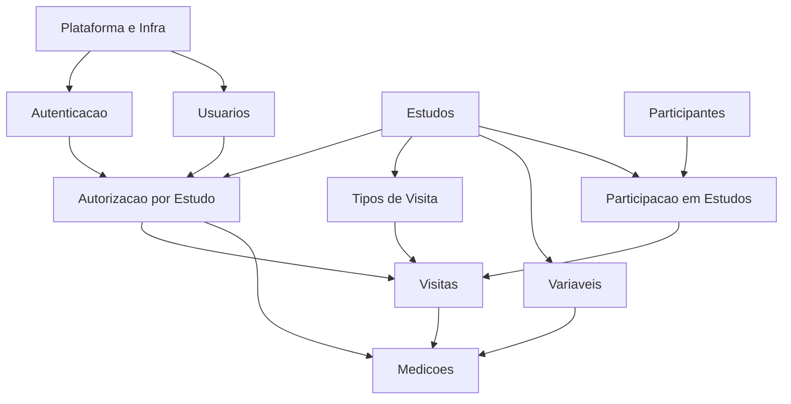

# BioRehab Lab - Documentacao Tecnica (Backend)

## Visao atual

- Stack: Node.js + Express + Prisma + Zod + JWT + bcrypt + MySQL.
- Funcionalidades existentes: cadastro e login de usuarios, middleware de autenticacao por token.
- Schema cobre dominio principal (estudos, participantes, visitas, medicoes, permissoes).
- Arquitetura em camadas ainda nao esta implementada de ponta a ponta (controllers com acesso direto ao Prisma).

## Modulos necessarios

### Modulo: Plataforma e Infra

- Responsabilidade: bootstrap da aplicacao, config, middlewares comuns, erros centralizados, logging e padrao de resposta.
- Entidades: nenhuma (transversal).
- Dependencias: nenhuma (base).
- Complexidade: media.

### Modulo: Autenticacao

- Responsabilidade: login, hash de senha, emissao/validacao de JWT, expiracao e revogacao futura.
- Entidades: Usuario.
- Dependencias: Plataforma e Infra.
- Complexidade: media.

### Modulo: Autorizacao por Estudo (RBAC)

- Responsabilidade: validar papel owner/collector/viewer por estudo em toda operacao sensivel.
- Entidades: PermissaoEstudo, Estudo, Usuario.
- Dependencias: Autenticacao, Estudos.
- Complexidade: complexa.

### Modulo: Usuarios

- Responsabilidade: cadastro, ativacao/inativacao, perfil, administracao de usuarios.
- Entidades: Usuario.
- Dependencias: Plataforma e Infra, Autenticacao.
- Complexidade: media.

### Modulo: Estudos

- Responsabilidade: criacao, atualizacao, status (ativo/inativo), soft delete, metadados do estudo.
- Entidades: Estudo.
- Dependencias: Plataforma e Infra.
- Complexidade: media.

### Modulo: Participantes

- Responsabilidade: cadastro, atualizacao e status do participante.
- Entidades: Participante.
- Dependencias: Plataforma e Infra.
- Complexidade: simples.

### Modulo: Participacao em Estudos

- Responsabilidade: vinculo participante-estudo, controle de codigo unico, status.
- Entidades: ParticipacaoEstudo, Participante, Estudo.
- Dependencias: Participantes, Estudos, Autorizacao.
- Complexidade: media.

### Modulo: Tipos de Visita

- Responsabilidade: catalogo de tipos de visita por estudo (baseline, follow-up, etc.).
- Entidades: TipoVisita, Estudo.
- Dependencias: Estudos, Autorizacao.
- Complexidade: simples.

### Modulo: Variaveis do Estudo (Dicionario de Dados)

- Responsabilidade: definicao de variaveis por estudo, tipo de dado, opcoes e unidade.
- Entidades: Variavel, Estudo.
- Dependencias: Estudos, Autorizacao.
- Complexidade: media.

### Modulo: Visitas

- Responsabilidade: registro de visitas, validacao de participante x estudo x tipo de visita, autoria.
- Entidades: Visita, Participante, Estudo, TipoVisita, Usuario.
- Dependencias: Participacao em Estudos, Tipos de Visita, Autorizacao.
- Complexidade: complexa.

### Modulo: Medicoes

- Responsabilidade: coleta de valores, validacao por dataType da variavel, consistencia scientifica.
- Entidades: Medicao, Variavel, Visita, Usuario.
- Dependencias: Variaveis do Estudo, Visitas, Autorizacao.
- Complexidade: complexa.

### Modulo: Consultas e Exportacao (planejado)

- Responsabilidade: endpoints de leitura otimizados, filtros e exportacao CSV/JSON.
- Entidades: Estudo, Participante, Visita, Medicao, Variavel.
- Dependencias: Visitas, Medicoes, Autorizacao.
- Complexidade: media.

### Modulo: Rastreabilidade e Auditoria (transversal)

- Responsabilidade: trilhas de alteracao, uso de createdAt/updatedAt/deletedAt, logs de operacoes criticas.
- Entidades: todas (sem entidade propria).
- Dependencias: Plataforma e Infra.
- Complexidade: media.

## Ordem ideal de implementacao (Roadmap)

1. Base tecnica: Plataforma e Infra + padrao de erros + validacao Zod + repositorios base.
2. Identidade: Usuarios + Autenticacao + ajustes de seguranca.
3. Governanca: Estudos + Autorizacao por Estudo (RBAC).
4. Cadastro clinico: Participantes + Participacao em Estudos.
5. Dicionario do estudo: Tipos de Visita + Variaveis.
6. Coleta longitudinal: Visitas + Medicoes.
7. Leitura/Exportacao: Consultas e Exportacao + refinamentos de rastreabilidade.

## Dependencias entre modulos (visao geral)

